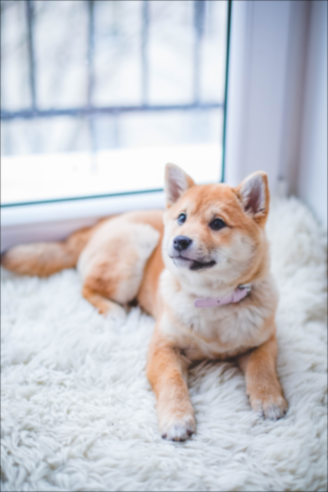

# Image Blurring CUDA

Lei Mao

## Introduction

This application blurs an RGB image with Gaussian kernel using OpenCV and CUDA. The CUDA kernel used 2D blocks and 2D threads to process 2D RGB images of arbitrary size. CMake was used to compile to executables.

## Dependencies

* CUDA 10.1
* OpenCV 4.1.0
* CMake 3.10.2

## Installation

```bash
$ chmod +x install.sh
$ ./install.sh
```

## Usages

Use executable file ``RGBBlur`` to blur RGB images.

```bash
$ ./RGBBlur input_image [output_image] [kernel_width] [gaussian_std]
```

For example,

```bash
$ ./RGBBlur ./images/RGB/dog.jpg ./images/Blur/dog.jpg 51 10.0
```

## Demo


RGB | Blur | 
:-------------------------:|:-------------------------:
 |  | 
 |  | 